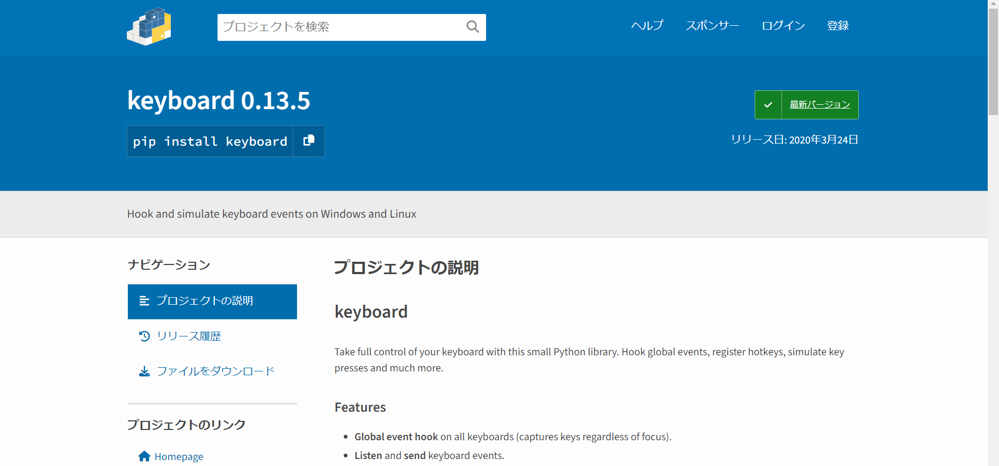
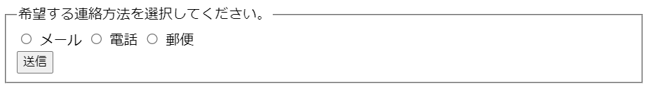
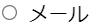

# lib763

自作ライブラリ

## how to install

```bash
git clone https://github.com/naru-99/lib763.git
cd lib763
pip install .
```

## 使い方一覧

- macro/mouse_keyboard.py

1. インスタンスを取得

   ```python
   from lib763.macro.mouse_keyboard import mouse_keyboard
   mk = mouse_keyboard()
   ```

2. キーボードの入力

   ```python
   mk.kb_input('ctrl+v')
   ```

   詳しくは[keyboard モジュールのドキュメント](https://pypi.org/project/keyboard/)を参照

3. マウスを操作
   ```python
   # マウスを移動
   mk.move_mouse((10, 10))
   # マウスを左クリック
   mk.click()
   ```
   上記は次のコードと等価：
   ```python
   mk.click_coordinate((10,10))
   ```
4. 文字列の入力
   ```python
   mk.write_word('hello, world!')
   ```
5. スクリーンショットの取得
   ```python
   mk.get_screen_shot('./screenshot.png')
   ```

- macro/image_recognition.py

1. スクリーンショットの中からボタンの座標を取得
   
   座標を取得したいボタン →
   

   ```python
   from lib763.macro.image_recognition import get_image_coordinate
   coordinate = get_image_coordinate('./screenshot.png','./button.png')
   ```

2. スクリーンショットを取得し、その中からボタンの座標を取得 → クリック

   ```python
   from lib763.macro.mouse_keyboard import mouse_keyboard
   from lib763.macro.image_recognition import get_image_coordinate

   mk = mouse_keyboard()
   mk.click_coordinate(get_image_coordinate('./screenshot.png','./button.png'))
   ```

3. ラジオボタンを押す<br>
   screenshot_radio_sample.png<br>
   
   subreg_radio_sample.png<br>
   <br>
   radio_button.png<br>
   <br>
   上記の、「メール」のラジオボタンを押したい場合：

   ```python
   from lib763.macro.mouse_keyboard import mouse_keyboard
   from lib763.macro.image_recognition import get_subregion_center

   mk = mouse_keyboard()
   mk.click_coordinate(
        get_subregion_center(
            "./screenshot_radio_sample.png",
            "./subreg_radio_sample.png",
            "./radio_button.png",
        )
    )
   ```

- chrome_window.py

1. インスタンスを取得
   ```python
   from lib763.macro.chrome_window import chrome_window
   chrome = chrome_window()
   ```
2. chrome の立ち上げ+url の入力
   ```python
   chrome.create_chrome_window()
   chrome.input_url_to_tab('https://www.google.com/')
   ```
3. chrome のウィンドウをアクティブ化+最大化
   ```python
   chrome.activate_chrome()
   ```
4. その他の操作
   ```python
   # タブを一つ作成
   chrome.create_tab()
   # タブを一つ削除
   chrome.erase_tub()
   # ウインドウを削除
   chrome.erase_window()
   ```
